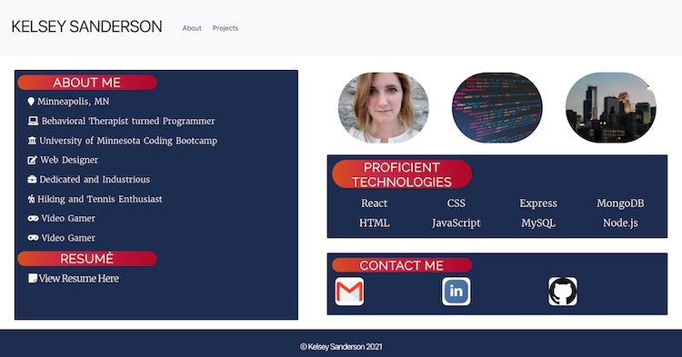
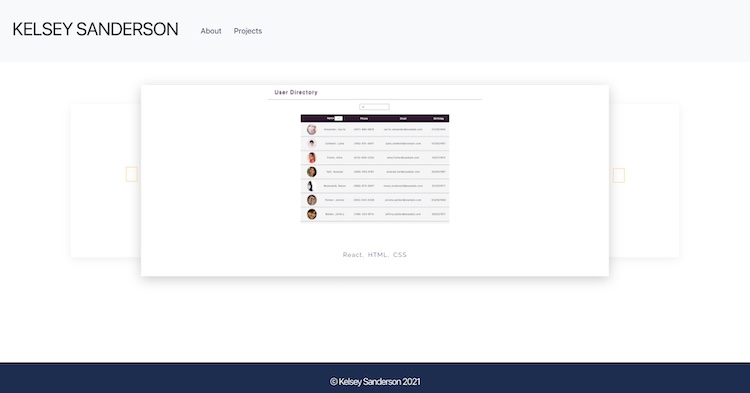

# React Portfolio

## Table of Contents
* [Description](README.md#Description)
* [URL](README.md#URL)
* [License](README.md#License)
* [Questions](README.md#Questions)

## Description
A professional React portfolio. Contains links to a projects page and an about me page. It also contains links to my LinkedIn, and GitHub pages.

### Screenshot 

## URL
[Live URL to Portfolio]( https://kelseysanderson.github.io/react-portfolio)

## License
Read more about the license here:
https://opensource.org/licenses/MIT

### Questions
If you have any questions, feel free to contact me:

GitHub: [Kelsey Sanderson GitHub](https://github.com/kelseysanderson)

Email:  [Kelsey Sanderson Email](mailto:kelseymonica@gmail.com)
